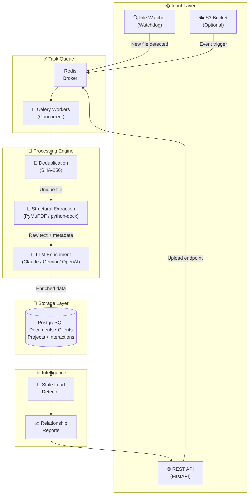

<p align="center">
  
  
  
  
  
  
</p>

<h1 align="center">📄 DocuFlow-CRM</h1>

<p align="center">
  <strong>A Headless, Document-Driven CRM Engine for Freelancers & Contractors</strong>
  <br />
  <em>Zero manual data entry — drop files, get structured CRM records.</em>
</p>

---

## 🎯 What is DocuFlow-CRM?

DocuFlow-CRM is a **headless CRM** designed for professionals who manage document-heavy projects — freelancers, contractors, and legal/consulting firms. Instead of manually entering client data into forms, you simply **drop project files** (proposals, contracts, invoices, case files) into a monitored directory, and the system automatically:

1. **Parses** the document structure (text, tables, metadata)
2. **Extracts** hard data (titles, dates, case numbers) via regex and NLP
3. **Enriches** with soft data (sentiment, budgets, deadlines) via LLM
4. **Creates** structured database records linked to clients and projects
5. **Monitors** relationship health with intelligent stale-lead detection

> **Think of it as:** *Dropbox meets Salesforce, with AI extraction in between.*

---

## ✨ Features

| Feature | Description |
|---|---|
| 🔍 **File Watcher** | Watchdog-powered real-time monitoring of local directories with debouncing |
| 📦 **Bulk Indexing** | Scan 100+ files, deduplicate by SHA-256 hash, dispatch parallel workers |
| 📄 **Hybrid Extraction** | Structural parsing (PyMuPDF/python-docx) + LLM enrichment (Claude/Gemini/OpenAI) |
| 🧠 **LLM Enrichment** | Auto-classify documents, extract budgets, sentiment, deadlines, key parties |
| ⚡ **Async Pipeline** | FastAPI + SQLAlchemy 2.0 async — non-blocking from API to database |
| 🔄 **Celery Workers** | Document processing runs in background workers, never blocking the API |
| 🚨 **Stale Lead Detection** | Automatic flagging of clients inactive for 14+ days |
| 📊 **Relationship Intelligence** | API-driven reporting on client engagement health |
| 🐳 **Dockerized** | Full docker-compose with PostgreSQL, Redis, API, workers, and watcher |
| 🔌 **Extensible Extractors** | Strategy pattern — add new file types without touching existing code |

---

## 🏗️ Architecture



---

## 📁 Project Structure

```
DocuFlow-CRM/
├── app/
│   ├── __init__.py
│   ├── main.py                          # FastAPI application factory
│   ├── config.py                        # Pydantic settings (12-factor)
│   ├── api/
│   │   ├── deps.py                      # Dependency injection
│   │   └── v1/
│   │       ├── router.py               # Aggregated API router
│   │       └── endpoints/
│   │           ├── health.py            # Health check
│   │           ├── clients.py           # Client CRUD
│   │           ├── projects.py          # Project CRUD
│   │           ├── documents.py         # Document upload (single + bulk)
│   │           └── intelligence.py      # Stale lead reports
│   ├── models/
│   │   ├── base.py                      # Declarative base + UUID mixin
│   │   ├── user.py                      # User model
│   │   ├── client.py                    # Client model (with status enum)
│   │   ├── project.py                   # Project model (LLM-enriched fields)
│   │   ├── document.py                  # Document model (JSONB metadata)
│   │   └── interaction.py               # Interaction audit log
│   ├── schemas/                         # Pydantic request/response schemas
│   ├── services/
│   │   ├── extraction/
│   │   │   ├── base.py                  # Abstract extractor (Strategy pattern)
│   │   │   ├── pdf_extractor.py         # PyMuPDF implementation
│   │   │   ├── docx_extractor.py        # python-docx implementation
│   │   │   ├── llm_enricher.py          # Multi-provider LLM service
│   │   │   └── registry.py              # Extractor registry (Open/Closed)
│   │   ├── ingestion/
│   │   │   └── pipeline.py              # Core ingestion orchestrator
│   │   ├── indexing/
│   │   │   └── engine.py                # Bulk scan + fan-out dispatcher
│   │   └── intelligence/
│   │       └── stale_detector.py        # Stale lead detector
│   ├── workers/
│   │   ├── celery_app.py                # Celery configuration + Beat schedule
│   │   └── tasks.py                     # Background tasks (process, index, detect)
│   ├── watcher/
│   │   ├── file_watcher.py              # Watchdog event handler + debouncing
│   │   └── run.py                       # Standalone watcher entry point
│   └── db/
│       ├── __init__.py                  # Async engine + session factory
│       └── session.py                   # Session re-exports
├── alembic/                             # Database migrations
├── tests/                               # Unit + integration tests
├── watch_directory/                     # Default monitored directory
├── ingestor.py                          # CLI entry point
├── Dockerfile                           # Multi-stage build
├── docker-compose.yml                   # Full stack orchestration
├── requirements.txt                     # Pinned dependencies
├── .env.example                         # Environment template
└── README.md
```

---

## 🛠️ Tech Stack

| Layer | Technology | Purpose |
|---|---|---|
| **API** | FastAPI 0.115+ | Async REST API with auto-generated OpenAPI docs |
| **Language** | Python 3.12+ | Type hints, async/await, modern syntax |
| **Database** | PostgreSQL 16 | JSONB for flexible LLM metadata storage |
| **ORM** | SQLAlchemy 2.0 (Async) | Declarative models with asyncpg driver |
| **Task Queue** | Celery 5.4 + Redis | Non-blocking document processing |
| **File Monitor** | Watchdog 6.0 | Cross-platform filesystem event detection |
| **PDF Parsing** | PyMuPDF (fitz) | Fast, accurate PDF text extraction |
| **DOCX Parsing** | python-docx | Word document parsing with table support |
| **LLM** | Claude / Gemini / OpenAI | Soft data extraction (sentiment, budgets, etc.) |
| **Migrations** | Alembic | Version-controlled database schema changes |
| **Containers** | Docker + Docker Compose | Reproducible, one-command deployment |

---

## 🚀 Quick Start

### Prerequisites

- Docker & Docker Compose (v2+)
- An LLM API key (Anthropic / Google / OpenAI) — *optional for basic testing*

### 1. Clone & Configure

```bash
git clone https://github.com/your-username/DocuFlow-CRM.git
cd DocuFlow-CRM

# Copy environment template
cp .env.example .env

# Edit .env with your LLM API key (optional)
# nano .env
```

### 2. Start All Services

```bash
docker compose up -d --build
```

This spins up:
- **API** → `http://localhost:8000`
- **Docs** → `http://localhost:8000/docs`
- **PostgreSQL** → `localhost:5432`
- **Redis** → `localhost:6379`
- **Celery Worker** (document processing)
- **Celery Beat** (scheduled stale-lead detection)
- **File Watcher** (monitoring `./watch_directory`)

### 3. Run Database Migrations

```bash
docker compose exec api alembic upgrade head
```

### 4. Test the Pipeline

```bash
# Drop a PDF into the watch directory — the watcher will auto-process it
cp ~/Documents/sample-contract.pdf ./watch_directory/

# Or use the API directly
curl -X POST http://localhost:8000/api/v1/documents/upload \
  -F "file=@./sample-contract.pdf"

# Check processed documents
curl http://localhost:8000/api/v1/documents/

# Run stale-lead detection
curl http://localhost:8000/api/v1/intelligence/stale-leads
```

### 5. CLI Mode (Without Docker)

```bash
# Create virtual environment
python -m venv .venv && source .venv/bin/activate
pip install -r requirements.txt

# Process a single file
python ingestor.py process --file ./contracts/agreement.pdf

# Watch a directory
python ingestor.py watch --directory ./watch_directory

# Bulk-index a folder (dry run)
python ingestor.py bulk --directory ./case_files

# Bulk-index + dispatch to Celery
python ingestor.py bulk --directory ./case_files --dispatch
```

---

## 📡 API Endpoints

| Method | Endpoint | Description |
|---|---|---|
| `GET` | `/api/v1/health/` | Service health check |
| `GET` | `/api/v1/clients/` | List clients (paginated, filterable) |
| `POST` | `/api/v1/clients/` | Create a client |
| `GET` | `/api/v1/clients/{id}` | Get client details |
| `PATCH` | `/api/v1/clients/{id}` | Update a client |
| `DELETE` | `/api/v1/clients/{id}` | Delete a client |
| `GET` | `/api/v1/projects/` | List projects |
| `POST` | `/api/v1/projects/` | Create a project |
| `GET` | `/api/v1/projects/{id}` | Get project details |
| `PATCH` | `/api/v1/projects/{id}` | Update a project |
| `POST` | `/api/v1/documents/upload` | Upload single document |
| `POST` | `/api/v1/documents/upload/bulk` | Bulk upload documents |
| `GET` | `/api/v1/documents/` | List documents |
| `GET` | `/api/v1/documents/{id}` | Get document details |
| `GET` | `/api/v1/intelligence/stale-leads` | Detect stale leads |
| `POST` | `/api/v1/intelligence/stale-leads/scan` | Trigger async scan |

> Full interactive docs available at `http://localhost:8000/docs`

---

## 🧪 Testing

```bash
# Run all tests
pytest tests/ -v

# Run with coverage
pytest tests/ --cov=app --cov-report=html
```

---

## 🧩 Extending Extractors

Adding support for a new file type requires **zero changes** to existing code (Open/Closed Principle):

```python
# app/services/extraction/xlsx_extractor.py

from app.services.extraction.base import BaseExtractor, ExtractionResult

class XLSXExtractor(BaseExtractor):
    @property
    def supported_extensions(self) -> set[str]:
        return {".xlsx"}

    async def extract(self, file_path: Path) -> ExtractionResult:
        # Your extraction logic here
        ...
```

Then register it:

```python
# app/services/extraction/registry.py
from app.services.extraction.xlsx_extractor import XLSXExtractor

class ExtractorRegistry:
    def __init__(self):
        self._extractors = [
            PDFExtractor(),
            DocxExtractor(),
            XLSXExtractor(),  # ← Just add it here
        ]
```

---

## 📐 Design Principles

- **SOLID Architecture** — Strategy pattern for extractors, Single Responsibility per module
- **12-Factor App** — All config via environment variables, stateless processes
- **Idempotent Ingestion** — SHA-256 deduplication prevents double-processing
- **Graceful Degradation** — LLM failures don't block structural extraction
- **Fan-Out Pattern** — Bulk uploads dispatch N independent worker tasks
- **Event-Driven** — File drops trigger processing without polling

---

## 📝 License

MIT © 2026

---

<p align="center">
  <strong>Built with 🔥 for the freelance developer community.</strong>
  <br />
  <sub>Star ⭐ this repo if it helped you build something awesome.</sub>
</p>
